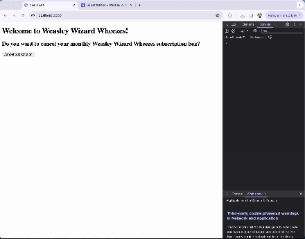
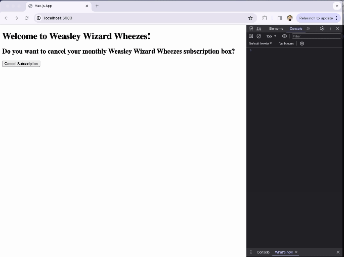
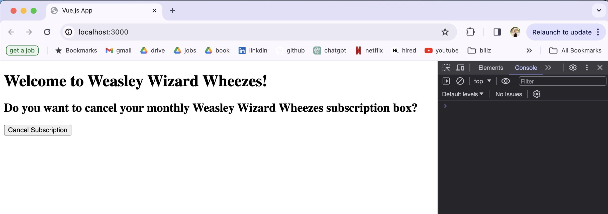
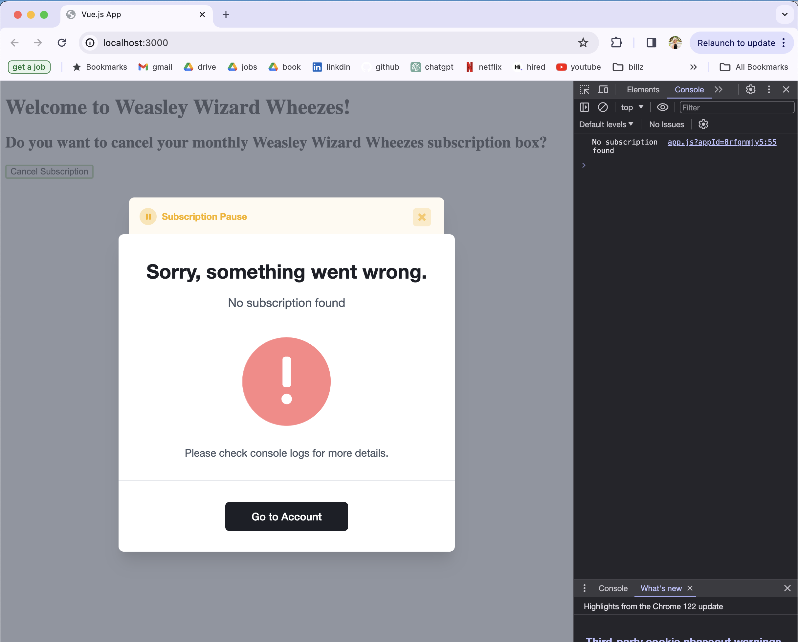

# 🔑 Churnkey Take Home :sparkles:

Create a simple webapp with a button which, when clicked, pops up the Churnkey cancellation modal.

## 🌟 Getting Started
1. git clone https://github.com/AlixLieblich/churnkeyTakeHome
2. cd churnkeyTakeHome
3. npm install express
4. npm install vue
5. node server.js

## 💻 Technologies used:
Vue.js, Node.js, HTML

## Creating a subscription to the Weekly Wizard Wheeze and then cancelling it

## 📸 Clicking the cancel button and popping up the modal

## 📸 The webapp with cancellation button

## 📸 The modal populating
### Modal opens, but test user does not have a subscription

## 💀 Assignment Pain Points
- Following: https://docs.churnkey.co/installing-churnkey
    -Step one: Asking to use YOUR_APP_ID
      - Where do I find my app id?
      - Ok, when following the embed instructions, it gives you the app_id (this could be clearer)
- Following: https://app.churnkey.co/settings/embed
    - Asking to use stripe_customer_id but without any context -> where should I obtain this?
        - there could be more context here in the docs; I obtained the stripe_customer_id by creating a test user within stripe, copying the id from stripe, and hardcoding the id into my code.
    - For Step One: Place embedded code
        - Would be easier to understand if there was a comment pointing out that your own personal app_id has been inserted into the code snippet
- In console, getting error: 
    - Error initializing Churnkey. This is typically due to a mismatched HMAC hash. Check the network logs for details.
      - I console logged my HMAC's from front and back end and saw that they did, in fact, match up.
      - My response in network logs:
        - "Cannot read properties of null (reading 'decorated')"
      - Finally, I stopped getting this error by changing mode from 'live' to 'test' within the window.churnkey.init
- In console, getting error:
    - No subscription found
    - My test user does not, in fact, have any subscriptions. Can add them if wanted!

